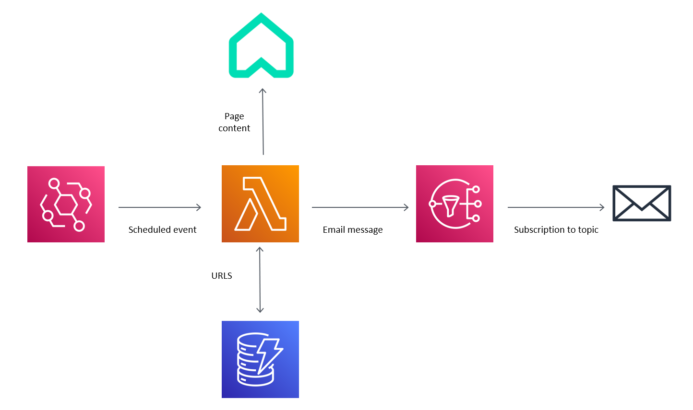

# Rightmove Alerter

 

Creating custom rightmove rental alerts using AWS Lambda.

## How it works

The `rightmove-alerter` Lambda function runs on a schedule (default 4 minutes). When provided with a map of Rightmove rental search criteria, it scrapes the search results page using [Enlive](https://github.com/cgrand/enlive) and extracts the URLS of any properties found. It then checks if any don't already exist in the `latest-homes` DynamoDB table, in which case it uploads them and creates an email message containing the new URLS. This is sent to the `latest-homes` SNS topic which is subscribed to by the user's email address.

The application and AWS infrastructure is deployed using the [AWS Serverless Application Model](https://aws.amazon.com/serverless/sam/) framework. The lambda function is deployed to a Docker container, following [this example](https://github.com/wtfleming/clojure-aws-lambda-example).

## Architecture

  

## Usage

To set this up for yourself, you'll first need the following:
- An AWS account.
- The [SAM CLI](https://docs.aws.amazon.com/serverless-application-model/latest/developerguide/serverless-sam-cli-install.html).
- [Docker](https://docs.docker.com/get-docker/).

Then follow these steps:
- Clone this repository.
- Ensure you have [AWS credentials configured](https://docs.aws.amazon.com/serverless-application-model/latest/developerguide/serverless-getting-started-set-up-credentials.html) on your machine.
- Get the location identifier from rightmove for the region you wish to search in. You can get this by conducting a search in your chosen area on [rightmove](https://www.rightmove.co.uk/) then taking the location identifier query parameter from the returned URL. It should look something like this: `REGION%5E1498`.
- Modify the JSON in `template.yml` `Resources > Lambdafunction > Events > MyScheduledEvent > Properties > Input` to contain your chosen search criteria. `location` is a mandatory key and the following are optional: `max-price, min-price, min-bedrooms, max-bedrooms, radius`.
- Modify `MySubscription > Properties > Endpoint` in `template.yml` to configure the subscription to your chosen email address.
- From the command line run `sam build` followed by `sam deploy` and accept all the default options.
- If everything worked the function should now be up and running in your AWS account. Everything in this project is within free tier limits so there shouldn't be any charges incurred.
