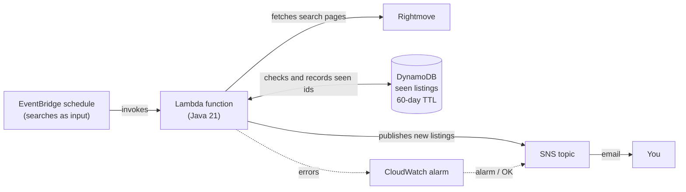

# Rightmove Alerter


Emails you new Rightmove rental listings, a few minutes after they're listed. It's a small Clojure AWS Lambda function that checks your searches on a schedule.

## How it works

Every 5 minutes (configurable), an EventBridge schedule invokes the function with your list of searches. For each search the function:

1. Fetches the first page of results, sorted newest first.
2. Reads the listings from the JSON Rightmove embeds in the page (`<script id="__NEXT_DATA__">`), skipping featured listings. If the page doesn't have the expected structure, the search fails rather than quietly finding nothing.
3. Drops listings already found by an earlier search in the same run, so a listing matching two searches is only sent once.

It then looks up the listing ids in DynamoDB, emails any it hasn't seen before through SNS, and only after the email is sent records them as seen. If sending fails, you get the listings on the next run rather than never. Seen listings expire from the table after 60 days.

If any search fails, the others still go ahead and the invocation reports an error. A CloudWatch alarm emails you when the function errors, and again when it recovers.

## Architecture


```mermaid
flowchart LR
    schedule["EventBridge schedule<br/>(searches as input)"] -->|invokes| fn["Lambda function<br/>(Java 21)"]
    fn -->|fetches search pages| rightmove["Rightmove"]
    fn <-->|checks and records seen ids| table[("DynamoDB<br/>seen listings<br/>60-day TTL")]
    fn -->|publishes new listings| topic["SNS topic"]
    topic -->|email| you["You"]
    fn -.->|errors| alarm["CloudWatch alarm"]
    alarm -.->|alarm / OK| topic
```

Everything is in two CloudFormation templates:

- [`infra/template.yml`](infra/template.yml): the app. The function, table, topic, email subscription, schedule and alarm.
- [`infra/bootstrap.yml`](infra/bootstrap.yml): deployed once. It holds the bucket for deployment artifacts, the role CloudFormation deploys the app with, and the role GitHub Actions assumes (through OIDC, with no stored AWS keys) to deploy.

## Searches

Searches are a JSON list. Each needs a `location`; everything else is optional:

```json
[
  {"name": "York", "location": "REGION^1498", "max-price": 1200, "min-bedrooms": 1},
  {"name": "York, furnished", "location": "REGION^1498", "radius": 1.0, "furnish-types": "furnished,partFurnished"}
]
```

| Key | Meaning |
|---|---|
| `location` | Rightmove's location identifier (see below). Required. |
| `name` | Heading for this search in the email. Defaults to the location. |
| `min-price`, `max-price` | Monthly rent. |
| `min-bedrooms`, `max-bedrooms` | |
| `radius` | Miles around the location. |
| `furnish-types` | Comma-separated: `furnished`, `partFurnished`, `unfurnished`. |

To find a location identifier, search for the area on [rightmove.co.uk](https://www.rightmove.co.uk/property-to-rent.html) and copy the `locationIdentifier` parameter from the results URL, e.g. `REGION%5E1498`. Either `REGION%5E1498` or `REGION^1498` works.

### Trying a search locally

The dry run prints the email a search would produce, without touching AWS. Every listing counts as new, since there's no table to check against:

```sh
clojure -M:run --search '{"name":"York","location":"REGION^1498","max-price":1200}'
clojure -M:run --searches searches.json
```

## Deploying

You'll need an AWS account, the [AWS CLI](https://aws.amazon.com/cli/) with credentials for it, Java 21 and the [Clojure CLI](https://clojure.org/guides/install_clojure). Everything fits in the AWS free tier.

### 1. Bootstrap (once per account)

```sh
aws cloudformation deploy \
  --template-file infra/bootstrap.yml \
  --stack-name rightmove-alerter-bootstrap \
  --capabilities CAPABILITY_IAM
```

If the account already has GitHub's OIDC provider (`aws iam list-open-id-connect-providers`), add `--parameter-overrides CreateGitHubOIDCProvider=false`. If you've forked the repo, also override `GitHubRepo`.

### 2a. Deploy from GitHub Actions

Every push runs the [CI workflow](.github/workflows/ci.yml): lint, unit tests, acceptance tests and an outdated-dependency check. When they pass, the deploy job waits for approval in the `production` environment. Deploys can come from any branch, but only once approved.

In the repo's **Settings → Environments**, create `production` with:

- **Required reviewers:** whoever may approve deploys.
- **Deployment branches:** all branches.
- **Variables:** `DEPLOY_ROLE_ARN` (the bootstrap stack's `GitHubDeployRoleArn` output) and `AWS_REGION`.
- **Secrets:** `NOTIFICATION_EMAIL` (where alerts go) and `SEARCHES` (your searches as JSON).

Only jobs in this environment can assume the deploy role, so an unapproved run never gets AWS credentials.

### 2b. Deploy from your machine

Put your searches in `searches.json` (it's gitignored), then:

```sh
NOTIFICATION_EMAIL=you@example.com scripts/deploy
```

`SEARCHES` can be set instead of using `searches.json`. `STACK_NAME` and `BOOTSTRAP_STACK_NAME` override the default stack names.

### 3. Confirm the subscription

After the first deploy, AWS emails you asking to confirm the SNS subscription. Alerts only arrive once you've confirmed. The first run will send everything currently on page one of each search, since none of it has been seen yet.

To change how often it runs or how long logs are kept, change the `ScheduleExpression` (`rate(5 minutes)`) and `LogRetentionDays` (14) defaults in `infra/template.yml`.

## Development

```sh
clojure -X:test                 # unit tests
scripts/run-acceptance-tests    # acceptance tests (needs Docker)
clojure -M:lint                 # clj-kondo
clojure -M:fmt check            # cljfmt (clojure -M:fmt fix to apply)
clojure -M:outdated             # antq: outdated deps.edn entries and GitHub Actions
```

The acceptance tests build the Lambda jar and run it in AWS's Java 21 Lambda runtime image, against [moto](https://github.com/getmoto/moto) standing in for DynamoDB, SNS and SQS, and [WireMock](https://wiremock.org/) standing in for Rightmove. The script starts everything with `docker compose`, runs the tests and always shuts it down. Arguments are passed to the test runner, e.g. `scripts/run-acceptance-tests -v rightmove-alerter.acceptance-test/markup-change-is-an-error`.

## Tearing down

Delete the app stack first, since it's deleted using the bootstrap stack's role:

```sh
aws cloudformation delete-stack --stack-name rightmove-alerter
aws cloudformation wait stack-delete-complete --stack-name rightmove-alerter
aws cloudformation delete-stack --stack-name rightmove-alerter-bootstrap
```

The artifacts bucket is kept when the bootstrap stack is deleted. Remove it with `aws s3 rb s3://<ArtifactsBucketName> --force`.
